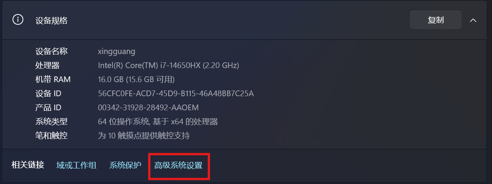
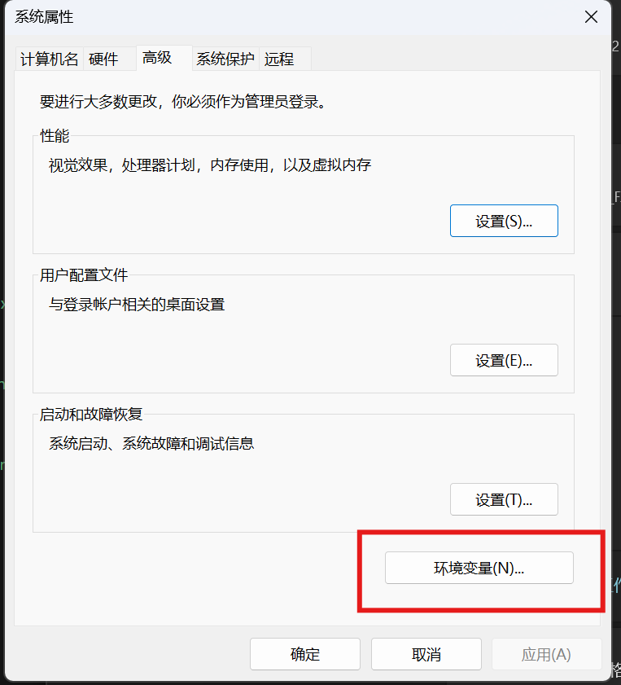
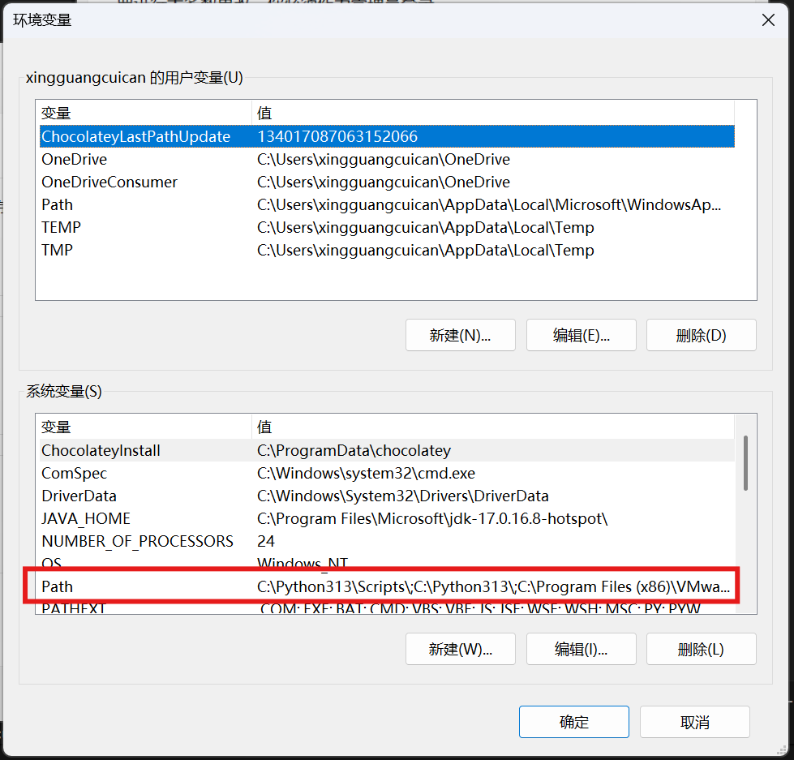
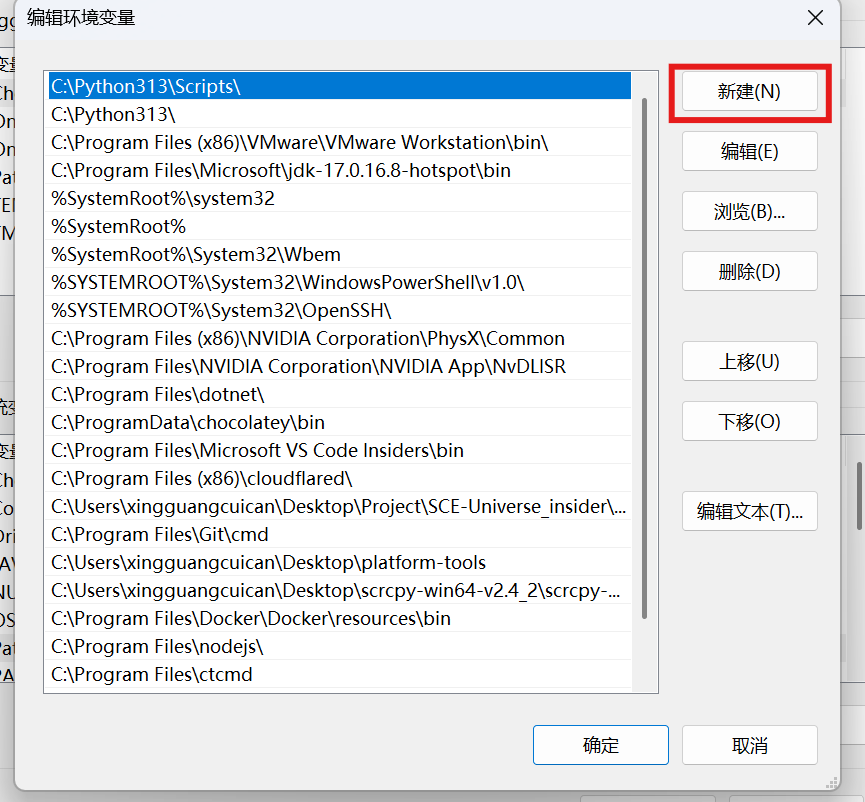

# CTCMD 用户手册

欢迎使用CTCMD，本手册面向用户，并为用户提供帮助，你可以在这里找到一些关于使用方面的帮助！

 - 本项目GitHub地址：https://github.com/xingguangcuican6666/custom_command

 - 加速链接(由OracleLoadStar提供)：https://git.oraclestar.cn/xingguangcuican6666/custom_command

## 1.1 安装

你可以在[Github Release](https://github.com/xingguangcuican6666/custom_command/releases)找到最新官方构建版本，然后解压到任意位置，接着打开**设置-关于-高级系统设置-环境变量-system下的path-新建**，选择你的解压位置即可。

## 1.2 如何启动

请使用**Win + R**打开运行，然后输入ctcmd，或者使用**Windows终端**应用，修改默认值为ctcmd.exe即可。

## 2.1 命令列表

### 2.1.1 官方包
标准官方包中存在以下命令

~~~batsh
ctcmd 支持如下命令：
  cd [目录]         切换目录
  set KEY=VALUE     设置环境变量
  env [KEY]         查看环境变量
  print 内容        输出内容（支持变量替换）
  ls [目录]         列出目录内容
  ps                查看进程列表
  pkill 进程名      按名杀进程
  对象.方法(参数)   调用批处理（如 power.shutdown(1)）
  exit              退出终端

可用对象.方法：
  module.winpt    软件包管理器
  std.cls    清屏，清除命令行窗口内容
  test.test
  win.cmd        打开命令提示符窗口，支持传递参数执行命令
  win.editor     用首选编辑器打开指定文件
  win.notepad    用记事本打开指定文件
  win.pwsh       用 PowerShell 打开指定脚本或命令
  wsl.bash           打开终端，传入参数时执行命令
  wsl.install_pkg    安装软件包
  wsl.update         更新软件源
~~~

### 2.2.2 自定义包

若您是自行编译，那么你可能没有安装**任何**模块，包括module，就好像Ubuntu**没有**apt，作为普通用户，我们**强烈建议**你使用我们的社区包管理器

#### 2.2.2.1 下载软件包管理器

请在[repo](https://github.com/xingguangcuican6666/ctcmd_repo/tree/main/module)中下载最新的**module-full**包，解压至ctcmd目录下。
注意：未加full后缀的为OTA包，并不完整。

文件结构如下：

~~~batsh
ctcmd
│  ctcmd.exe
│  xxx.xxx
|
└─module
   │  help.json
   │  source.ctcmd
   │  version.txt
   │  winpt.bat
   │
   ├─cache
   │
   ├─temp
   |
   └─tools
~~~

#### 2.2.2.2 修补软件包管理器

只放置软件包管理器模块**无法**让软件包管理器认出自己，你需要打开ctcmd，运行以下命令修补软件包管理器。

***更新官方源：***
~~~cpp
module.winpt(update)
~~~

***修补软件包管理器***
~~~cpp
module.winpt(install,module)
~~~

#### 2.2.2.3 修补其他官方软件包（可选）

这些软件包是官方提供的包，它们包含了一些关于Windows默认命令的兼容，我们**强烈建议**您安装，但是不安装也**不会**对CTCMD产生任何破坏。

请依次执行以下命令：
~~~cpp
module.winpt(install,wsl)
module.winpt(install,win)
module.winpt(install,std)
~~~

以下是各包包含的内容
- wsl:对wsl相关命令的兼容
- win:对Windows原有终端命令兼容
- std:额外终端命令

## 2.2 命令解析

非终端命令请使用 **包名.方法(参数1,参数2,...)** 的形式使用，而终端命令可直接使用，例如 `cd`,`ls`,`exit`...

## 2.3 软件包管理器

CTCMD内置了软件包管理器，你可以按照以下命令使用它。

安装软件包：
~~~cpp
module.winpt(install,xxx)
~~~

安装软件包（指定版本）：
~~~cpp
module.winpt(install,xxx,x.x.x)
~~~

更新软件源缓存：
~~~cpp
module.winpt(update)
~~~

更新所有软件包：
~~~cpp
module.winpt(upgrade)
~~~

移除指定软件包：
~~~cpp
module.winpt(remove,xxx)
~~~

安装后的软件会添加到命令列表，你可以在ctcmd中使用help命令查询